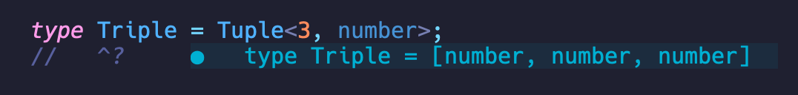

<h1 align="center">Witt - What Is The Type in Neovim</h1>
<div align="center">

</div>

## Installation

### Using [Lazy.nvim](https://github.com/folke/lazy.nvim)

Add the following to your Neovim configuration:

```lua
    {
        "typed-rocks/witt-neovim",
        config = function()
            require("witt")
        end
    },

```
## Usage
Use it like you would in a typescript-playground. Just add a comment on the line below your type and point it to your type:

```typescript

type YourType = A | B | C;
//    ^? 
```
This will then show the result of your Type like tsserver would do it when hovering.
### All options

`Tsw rt=[bun|node|deno] show_variables=[true|false] show_order=[true|false]`

### Defaults:

`Tsw rt=node show_variables=false show_order=false`

